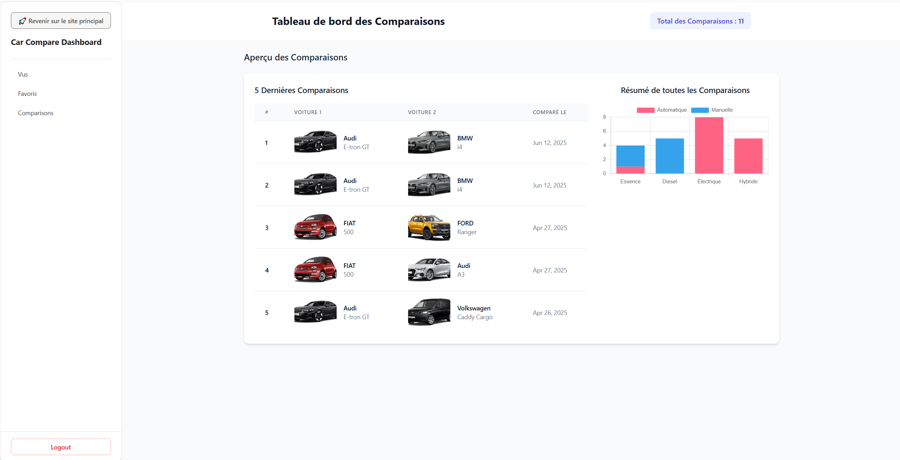

# 🚗 CarCompare - Automobile Tunisia Clone

Welcome to **CarCompare**, a feature-rich Angular application inspired by [automobile.tn](https://www.automobile.tn)! This project allows users to browse, compare, and manage car details with a modern web dashboard for admins. Built with ❤️ using **Angular** **TypeScript**, **Firebase**, **Cloudinary**, and **NgCharts**, it’s a full-stack clone showcasing modern web technologies.


## ✨ Features

- **Car Listings**: View detailed car specs, prices, images, and technical specifications for a car. 📋
- **Car Comparison**: Allows Compare multiple users to compare cars side-by-side based on specifications and features. ⚖️
- **Admin Dashboard**: Manage cars, brands, and body types, with real-time analytics for (views, likes, comparisons).
- **Authentication**: Secure user login/signup powered by Firebase Authentication for users. 🔒🔗
- **Image Uploads**: Upload images seamlessly with seamless uploads using cloudinaryCloudinary. ☁️
- **Charts**: Visualize dashboard data with interactive charts using NgCharts for data visualization. 📈
- **Responsive Design**: Fully responsive user interface UI for desktop and mobile users. 📱

## 🛠️ Tech Stack

- **Frontend**: Angular, TypeScript, NgCharts
- **Authentication**: Firebase Authentication 
- **Image Storage**: Cloudinary 
- **Backend**: JSON Server (mock backend)
- **Deployment**: Firebase Hosting

## 📂 Project Structure

The project follows a modular Angular architecture. Below is the class diagram illustrating the core components:


## 📸 Screenshots

Here are some glimpses of the application:

| Homepage | Car Details | Compare Cars | Admin Dashboard |
|----------|-------------|--------------|-----------------|
|  |  |  |  |

| Add Car | Login | Signup | Marques List |
|---------|-------|--------|--------------|
|  |  |  |  |

Explore more in the [screenshots folder](images/screenshots/).

## 🚀 Getting Started

Follow these steps to run the project locally.

### Prerequisites

- Node.js (v16 or higher)
- Angular CLI (`npm install -g @angular/cli`)
- Firebase CLI (`npm install -g firebase-tools`)
- JSON Server (`npm install -g json-server`)

### Installation

1. **Clone the Repository**:
   ```bash
   git clone https://github.com/your-username/carcompare.git
   cd carcompare
   ```

2. **Install Dependencies**:
   ```bash
   npm install
   ```

3. **Set Up Firebase**:
   - Create a Firebase project at [console.firebase.google.com](https://console.firebase.google.com).
   - Enable Authentication (Email/Password).
   - Copy your Firebase config and update `src/environments/environment.ts`.

4. **Set Up Cloudinary**:
   - Create a Cloudinary account at [cloudinary.com](https://cloudinary.com).
   - Add your Cloudinary API keys to the environment configuration.

5. **Run JSON Server** (Mock Backend):
   ```bash
   npm run json-server
   ```
   This starts the mock backend at `http://localhost:3000`.

6. **Run the Angular App**:
   ```bash
   ng serve
   ```
   Open [http://localhost:4200](http://localhost:4200) in your browser.

**Note**: Ensure the JSON Server is running locally, even when the app is hosted online, as it serves as the mock backend.

## 🔥 Deployment to Firebase Hosting

To deploy the app to Firebase Hosting, follow these steps:

1. **Install Firebase CLI**:
   ```bash
   npm install -g firebase-tools
   ```

2. **Login to Firebase**:
   ```bash
   npx firebase login
   ```

3. **Initialize Firebase**:
   ```bash
   npx firebase init
   ```
   - Select **Hosting**.
   - Choose your Firebase project.
   - Set `dist/your-app-name` as the public directory.

4. **Build the App**:
   ```bash
   ng build --configuration production
   ```

5. **Deploy to Firebase**:
   ```bash
   firebase deploy --only hosting
   ```

The app is now live at: [https://carcompare-9d422.web.app/home](https://carcompare-9d422.web.app/home) 🎉

**Important**: Keep the JSON Server running locally to ensure backend functionality.

## 🧑‍💻 Contributing

Contributions are welcome! Please follow these steps:

1. Fork the repository.
2. Create a new branch (`git checkout -b feature/your-feature`).
3. Commit your changes (`git commit -m 'Add your feature'`).
4. Push to the branch (`git push origin feature/your-feature`).
5. Open a Pull Request.

## 📬 Contact

For questions or feedback, reach out via [chedychaaben@gmail.com](mailto:chedychaaben@gmail.com) or open an issue on GitHub.

## 🙌 Acknowledgments

- [Angular](https://angular.io) for the powerful framework.
- [Firebase](https://firebase.google.com) for authentication and hosting.
- [Cloudinary](https://cloudinary.com) for image management.
- [NgCharts](https://www.chartjs.org) for beautiful charts.
- Inspired by [automobile.tn](https://www.automobile.tn).

Happy coding! 🚘